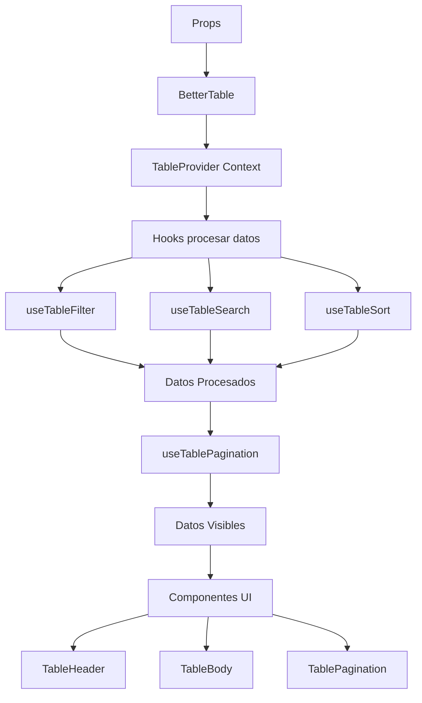
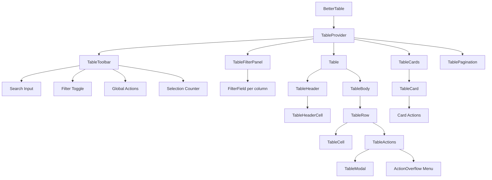

# Arquitectura de BetterTable

## 🏗️ Visión General

BetterTable es una librería de tabla de datos moderna y flexible construida con React y TypeScript. Sigue una arquitectura basada en composición, hooks y Context API para máxima flexibilidad y reutilización.

## 📐 Principios de Diseño

### 1. Composición sobre Herencia

Los componentes están diseñados para ser composables, permitiendo construir interfaces complejas a partir de piezas simples.

### 2. Separación de Responsabilidades

- **Componentes UI**: Presentación pura sin lógica de negocio
- **Hooks**: Lógica reutilizable y estado
- **Context**: Compartir estado entre componentes
- **Utilidades**: Funciones puras de transformación de datos

### 3. Tipos Seguros

TypeScript se usa extensivamente con genéricos para garantizar type-safety en toda la aplicación.

### 4. Headless cuando es posible

La lógica está separada de la presentación, permitiendo personalización máxima.

## 🔧 Capas de la Arquitectura

```
┌─────────────────────────────────────────┐
│         Component Layer                 │
│  (UI Components - Presentational)       │
├─────────────────────────────────────────┤
│         Hook Layer                      │
│  (Business Logic - useState, useEffect) │
├─────────────────────────────────────────┤
│         Context Layer                   │
│  (State Management - Shared State)      │
├─────────────────────────────────────────┤
│         Utility Layer                   │
│  (Pure Functions - Data Transformation) │
└─────────────────────────────────────────┘
```

## 🎯 Componentes Principales

### BetterTable (Componente Raíz)

El componente principal que orquesta toda la funcionalidad.

**Responsabilidades:**

- Inicializar el contexto de la tabla
- Procesar props y crear configuración
- Renderizar componentes hijos
- Manejar el ciclo de vida

### TableContext (Gestión de Estado)

Context API que proporciona estado y funciones a todos los componentes hijos.

**Estado Compartido:**

- Datos procesados (filtrados, ordenados)
- Estado de ordenamiento
- Filtros activos
- Búsqueda global
- Selección de filas
- Paginación

### Hooks Especializados

Cada hook maneja un aspecto específico de la funcionalidad:

- **useTableSort**: Ordenamiento de columnas
- **useTableFilter**: Filtrado por columna
- **useTableSearch**: Búsqueda global
- **useTableSelection**: Selección de filas
- **useTablePagination**: Paginación de datos

## 🔄 Flujo de Datos



## 🏛️ Jerarquía de Componentes



## 🔄 Estados del Sistema

```mermaid
stateDiagram-v2
    [*] --> Idle: Inicialización

    Idle --> Filtering: Usuario filtra
    Filtering --> Idle: Filtros aplicados

    Idle --> Searching: Usuario busca
    Searching --> Idle: Búsqueda aplicada

    Idle --> Sorting: Click en header
    Sorting --> Idle: Datos ordenados

    Idle --> Loading: Prop loading=true
    Loading --> Idle: loading=false

    Idle --> Empty: Sin datos
    Empty --> Idle: Datos disponibles
    K --> O[TableToolbar]
    K --> P[TableCards - Mobile]
```

### Pipeline de Procesamiento

1. **Datos Originales** → Props `data`
2. **Filtrado** → `useTableFilter` aplica filtros por columna
3. **Búsqueda** → `useTableSearch` aplica búsqueda global
4. **Ordenamiento** → `useTableSort` ordena resultados
5. **Paginación** → `useTablePagination` divide en páginas
6. **Renderizado** → Componentes UI muestran datos finales

## 🧱 Sistema de Internacionalización (i18n)

### Locales Preconfigurados

BetterTable incluye locales predefinidos para Inglés, Español y Portugués:

```typescript
import { locales, defaultLocale } from "better-table";
// locales.en, locales.es, locales.pt
```

### Flujo de Resolución de Locale

```
Prop locale          Resultado
─────────────────    ────────────────────────────────────────
undefined            → defaultLocale (English)
'en'                 → locales.en
'es'                 → locales.es
'pt'                 → locales.pt
{ noData: "..." }    → { ...defaultLocale, noData: "..." }
```

Todas las keys del `TableLocale` (20 strings) cubren: búsqueda, filtrado, paginación, selección, acciones, ordenamiento y modales.

## 🎨 Arquitectura de Estilos

### Sistema de Clases CSS

Usa un sistema de clases con prefijo `bt-` (BetterTable) para evitar conflictos:

```
bt-container      → Contenedor principal
bt-table          → Elemento <table>
bt-thead          → Header
bt-tbody          → Body
bt-tr             → Row
bt-td, bt-th      → Cells
bt-pagination     → Paginación
bt-toolbar        → Barra de herramientas
bt-filter-panel   → Panel de filtros
bt-overflow-*     → Dropdown de overflow de acciones
bt-cards          → Vista de cards (móvil)
```

### Variables CSS

Customización mediante CSS variables:

```css
--bt-primary-color
--bt-border-color
--bt-hover-bg
--bt-selected-bg
--bt-font-size-small
--bt-font-size-medium
--bt-font-size-large
```

### CSS Isolation (Aislamiento de Estilos)

Para evitar que estilos externos rompan BetterTable, el CSS incluye un **bloque de aislamiento** al inicio de `table.css`:

```
1. Box-sizing reset ─── .bt-container *, ::before, ::after { box-sizing: border-box }
2. Typography base ──── .bt-container { font-family, font-size, color, line-height }
3. Element resets ───── .bt-container :where(table, th, td, button, input, select, h2, a)
4. Portal isolation ─── .bt-overflow-menu { font-family, box-sizing, element resets }
```

Los resets usan `:where()` para mantener especificidad (0,1,0) — superan selectores de elemento (`table {}`, `button {}`) sin pisar las reglas `.bt-*` propias. El overflow menu se aísla por separado porque usa `createPortal(menu, document.body)`.

## � Arquitectura Responsive

### Estrategia CSS-Only

El diseño responsive se implementa exclusivamente con CSS media queries, sin agregar complejidad al componente React:

| Breakpoint | Comportamiento              |
| ---------- | --------------------------- |
| >1024px    | Tabla completa tradicional  |
| 640-1024px | Tabla con scroll horizontal |
| <640px     | Cards layout (tabla oculta) |

### Componentes de Cards

Para la vista móvil, se renderizan componentes adicionales:

```
┌─ Table.tsx ─────────────────────────────────┐
│                                             │
│  <table>...</table>  ← Visible en Desktop   │
│                                             │
│  <TableCards>        ← Visible en Móvil     │
│    <TableCard />                            │
│    <TableCard />                            │
│  </TableCards>                              │
│                                             │
└─────────────────────────────────────────────┘
```

**Nota**: Ambos elementos coexisten en el DOM. CSS controla la visibilidad según el viewport.

## �🔌 Puntos de Extensión

### 1. Custom Cell Renderers

```typescript
{
  cell: (value, row, index) => <CustomComponent {...} />
}
```

### 2. Row Actions con Modals

```typescript
{
  mode: 'modal',
  modalContent: CustomModalComponent
}
```

### 3. Global Actions

```typescript
{
	onClick: (selectedRows, allData) => {
		/* custom logic */
	};
}
```

### 4. Custom Hooks

Los hooks internos son exportados para uso avanzado:

```typescript
import { useTableSort, useTableFilter } from "better-table";
```

## 📦 Empaquetado y Distribución

### Formatos de Build

- **ES Modules** (`better-table.es.js`) - Para bundlers modernos
- **CommonJS** (`better-table.cjs.js`) - Para Node.js
- **TypeScript Definitions** (`index.d.ts`) - Tipos

### Tree-Shaking

Estructura modular permite tree-shaking eficiente:

```typescript
// Solo importa lo necesario
import { BetterTable } from "better-table";
// vs
import { useTableSort, sortData } from "better-table";
```

## 🧪 Estrategia de Testing

### Niveles de Testing

1. **Unit Tests**: Hooks y utilidades (funciones puras)
2. **Integration Tests**: Componentes con Context
3. **E2E Tests**: Flujos completos de usuario

**Coverage actual:** 18 archivos de test, 87 tests

### Testing Library

Usa `@testing-library/react` con enfoque en:

- Testing desde la perspectiva del usuario
- Queries accesibles (getByRole, getByLabelText)
- User events para interacciones

## 🔒 Type Safety

### Sistema de Tipos Genéricos

```typescript
interface BetterTableProps<T extends TableData> {
	data: T[];
	columns: Column<T>[];
	// ... props son type-safe con T
}
```

El tipo genérico `T` fluye a través de:

- Columns
- Row Actions
- Cell renderers
- Callbacks

Esto garantiza que el tipo de datos es consistente en toda la aplicación.

## 🎯 Decisiones de Diseño

### ¿Por qué Context API?

- Estado compartido entre muchos componentes
- Evita prop drilling
- Performance optimizada con useMemo

### ¿Por qué Hooks personalizados?

- Lógica reutilizable
- Testing más fácil
- Separación de responsabilidades

### ¿Por qué dot notation en accessors?

- Soporte para datos anidados sin código extra
- API más limpia
- Flexibilidad para estructuras complejas

### ¿Por qué CSS vanilla?

- No requiere dependencias adicionales
- Fácil customización
- Menor tamaño del bundle
- Compatible con cualquier sistema CSS

## 🚀 Performance

### Optimizaciones Implementadas

1. **useMemo** para datos procesados
2. **useCallback** para funciones de evento
3. **Virtualización** (planificada para v2)
4. **Lazy loading** de modales
5. **CSS sin JavaScript runtime**

### Métricas Target

- **Bundle size**: < 35KB (gzipped)
- **First render**: < 50ms para 100 filas
- **Re-render**: < 16ms (60fps)

## 🔮 Roadmap Arquitectónico

### Próximas Mejoras

1. **Virtualización**: Soporte para miles de filas
2. **Server-side operations**: Filtrado/ordenamiento en servidor
3. **Column resizing**: Redimensionar columnas
4. **Column reordering**: Reordenar columnas con drag & drop
5. **Export**: Excel, CSV, PDF
6. **Themes**: Sistema de temas predefinidos
