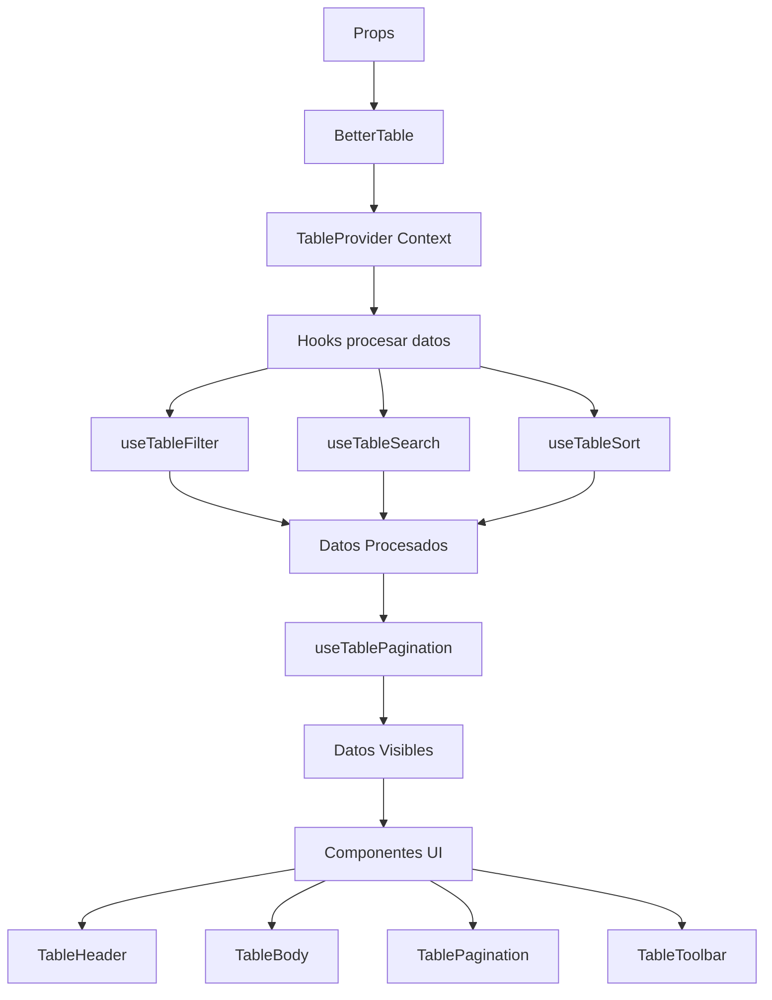

# Arquitectura de BetterTable

## 🏗️ Visión General

BetterTable es una librería de tabla de datos moderna y flexible construida con React y TypeScript. Sigue una arquitectura basada en composición, hooks y Context API para máxima flexibilidad y reutilización.

## 📐 Principios de Diseño

### 1. Composición sobre Herencia

Los componentes están diseñados para ser composables, permitiendo construir interfaces complejas a partir de piezas simples.

### 2. Separación de Responsabilidades

- **Componentes UI**: Presentación pura sin lógica de negocio
- **Hooks**: Lógica reutilizable y estado
- **Context**: Compartir estado entre componentes
- **Utilidades**: Funciones puras de transformación de datos

### 3. Tipos Seguros

TypeScript se usa extensivamente con genéricos para garantizar type-safety en toda la aplicación.

### 4. Headless cuando es posible

La lógica está separada de la presentación, permitiendo personalización máxima.

## 🔧 Capas de la Arquitectura

```
┌─────────────────────────────────────────┐
│         Component Layer                 │
│  (UI Components - Presentational)       │
├─────────────────────────────────────────┤
│         Hook Layer                      │
│  (Business Logic - useState, useEffect) │
├─────────────────────────────────────────┤
│         Context Layer                   │
│  (State Management - Shared State)      │
├─────────────────────────────────────────┤
│         Utility Layer                   │
│  (Pure Functions - Data Transformation) │
└─────────────────────────────────────────┘
```

## 🎯 Componentes Principales

### BetterTable (Componente Raíz)

El componente principal que orquesta toda la funcionalidad.

**Responsabilidades:**

- Inicializar el contexto de la tabla
- Procesar props y crear configuración
- Renderizar componentes hijos
- Manejar el ciclo de vida

### TableContext (Gestión de Estado)

Context API que proporciona estado y funciones a todos los componentes hijos.

**Estado Compartido:**

- Datos procesados (filtrados, ordenados)
- Estado de ordenamiento
- Filtros activos
- Búsqueda global
- Selección de filas
- Paginación

### Hooks Especializados

Cada hook maneja un aspecto específico de la funcionalidad:

- **useTableSort**: Ordenamiento de columnas
- **useTableFilter**: Filtrado por columna
- **useTableSearch**: Búsqueda global
- **useTableSelection**: Selección de filas
- **useTablePagination**: Paginación de datos

## 🔄 Flujo de Datos



### Pipeline de Procesamiento

1. **Datos Originales** → Props `data`
2. **Filtrado** → `useTableFilter` aplica filtros por columna
3. **Búsqueda** → `useTableSearch` aplica búsqueda global
4. **Ordenamiento** → `useTableSort` ordena resultados
5. **Paginación** → `useTablePagination` divide en páginas
6. **Renderizado** → Componentes UI muestran datos finales

## 🎨 Arquitectura de Estilos

### Sistema de Clases CSS

Usa un sistema de clases con prefijo `bt-` (BetterTable) para evitar conflictos:

```
bt-container      → Contenedor principal
bt-table          → Elemento <table>
bt-thead          → Header
bt-tbody          → Body
bt-tr             → Row
bt-td, bt-th      → Cells
bt-pagination     → Paginación
bt-toolbar        → Barra de herramientas
```

### Variables CSS

Customización mediante CSS variables:

```css
--bt-primary-color
--bt-border-color
--bt-hover-bg
--bt-selected-bg
--bt-font-size-small
--bt-font-size-medium
--bt-font-size-large
```

## 🔌 Puntos de Extensión

### 1. Custom Cell Renderers

```typescript
{
  cell: (value, row, index) => <CustomComponent {...} />
}
```

### 2. Row Actions con Modals

```typescript
{
  mode: 'modal',
  modalContent: CustomModalComponent
}
```

### 3. Global Actions

```typescript
{
	onClick: (selectedRows, allData) => {
		/* custom logic */
	};
}
```

### 4. Custom Hooks

Los hooks internos son exportados para uso avanzado:

```typescript
import { useTableSort, useTableFilter } from "better-table";
```

## 📦 Empaquetado y Distribución

### Formatos de Build

- **ES Modules** (`better-table.es.js`) - Para bundlers modernos
- **CommonJS** (`better-table.cjs.js`) - Para Node.js
- **TypeScript Definitions** (`index.d.ts`) - Tipos

### Tree-Shaking

Estructura modular permite tree-shaking eficiente:

```typescript
// Solo importa lo necesario
import { BetterTable } from "better-table";
// vs
import { useTableSort, sortData } from "better-table";
```

## 🧪 Estrategia de Testing

### Niveles de Testing

1. **Unit Tests**: Hooks y utilidades (funciones puras)
2. **Integration Tests**: Componentes con Context
3. **E2E Tests**: Flujos completos de usuario

### Testing Library

Usa `@testing-library/react` con enfoque en:

- Testing desde la perspectiva del usuario
- Queries accesibles (getByRole, getByLabelText)
- User events para interacciones

## 🔒 Type Safety

### Sistema de Tipos Genéricos

```typescript
interface BetterTableProps<T extends TableData> {
	data: T[];
	columns: Column<T>[];
	// ... props son type-safe con T
}
```

El tipo genérico `T` fluye a través de:

- Columns
- Row Actions
- Cell renderers
- Callbacks

Esto garantiza que el tipo de datos es consistente en toda la aplicación.

## 🎯 Decisiones de Diseño

### ¿Por qué Context API?

- Estado compartido entre muchos componentes
- Evita prop drilling
- Performance optimizada con useMemo

### ¿Por qué Hooks personalizados?

- Lógica reutilizable
- Testing más fácil
- Separación de responsabilidades

### ¿Por qué dot notation en accessors?

- Soporte para datos anidados sin código extra
- API más limpia
- Flexibilidad para estructuras complejas

### ¿Por qué CSS vanilla?

- No requiere dependencias adicionales
- Fácil customización
- Menor tamaño del bundle
- Compatible con cualquier sistema CSS

## 🚀 Performance

### Optimizaciones Implementadas

1. **useMemo** para datos procesados
2. **useCallback** para funciones de evento
3. **Virtualización** (planificada para v2)
4. **Lazy loading** de modales
5. **CSS sin JavaScript runtime**

### Métricas Target

- **Bundle size**: < 35KB (gzipped)
- **First render**: < 50ms para 100 filas
- **Re-render**: < 16ms (60fps)

## 🔮 Roadmap Arquitectónico

### Próximas Mejoras

1. **Virtualización**: Soporte para miles de filas
2. **Server-side operations**: Filtrado/ordenamiento en servidor
3. **Column resizing**: Redimensionar columnas
4. **Column reordering**: Reordenar columnas con drag & drop
5. **Export**: Excel, CSV, PDF
6. **Themes**: Sistema de temas predefinidos
