# Flujos de Interacción de BetterTable

Diagramas de secuencia y explicación detallada de las interacciones entre componentes.

## 🔄 Flujo General de Renderizado

```mermaid
sequenceDiagram
    participant User
    participant BetterTable
    participant TableProvider
    participant Hooks
    participant Components

    User->>BetterTable: Props (data, columns)
    BetterTable->>TableProvider: Inicializar Context
    TableProvider->>Hooks: Procesar datos
    Hooks->>Hooks: Filter → Search → Sort
    Hooks->>TableProvider: Datos procesados
    TableProvider->>Components: Proveer state
    Components->>User: Render UI
```



---

## 📊 1. Ordenamiento de Columnas

### Flujo de Interacción



```mermaid
sequenceDiagram
    participant User
    participant TableHeaderCell
    participant useTableSort
    participant TableBody

    User->>TableHeaderCell: Click en header
    TableHeaderCell->>useTableSort: handleSort(columnId)

    alt Primera vez
        useTableSort->>useTableSort: Set direction='asc'
    else Segunda vez
        useTableSort->>useTableSort: Set direction='desc'
    else Tercera vez
        useTableSort->>useTableSort: Set direction=null
    end

    useTableSort->>useTableSort: sortData()
    useTableSort->>TableBody: Datos ordenados
    TableBody->>User: Muestra datos ordenados
    TableHeaderCell->>User: Muestra indicador (↑↓)
```

### Código Relevante

```typescript
// En TableHeaderCell
const handleHeaderClick = () => {
	if (column.sortable) {
		handleSort(column.id);
	}
};

// En useTableSort
const handleSort = (columnId: string) => {
	setSortState((prev) => {
		if (prev.column === columnId) {
			// Ciclo: asc → desc → null
			const nextDirection =
				prev.direction === "asc"
					? "desc"
					: prev.direction === "desc"
						? null
						: "asc";

			return {
				column: nextDirection ? columnId : null,
				direction: nextDirection,
			};
		}
		return { column: columnId, direction: "asc" };
	});
};
```

### Estados del Ordenamiento

1. **No ordenado**: `{ column: null, direction: null }`
2. **Ascendente**: `{ column: 'name', direction: 'asc' }` → Icono ↑
3. **Descendente**: `{ column: 'name', direction: 'desc' }` → Icono ↓

---

## 🔍 2. Filtrado por Columna

### Flujo de Interacción


### Tipos de Filtro

#### String (texto)

```typescript
// Input: <input type="text" />
// Lógica: case-insensitive contains
value.toString().toLowerCase().includes(filter.toLowerCase());
```

#### Number

```typescript
// Input: <input type="number" />
// Lógica: exact match
value === Number(filter);
```

#### Boolean

```typescript
// Input: <select>
// Opciones: true | false | all
value === (filter === "true");
```

### Múltiples Filtros

Los filtros se aplican con lógica AND:

```
Row visible = Filter1 AND Filter2 AND Filter3
```

---

## 🔎 3. Búsqueda Global

### Flujo de Interacción


### Comportamiento

```typescript
// Busca en todas las columnas donde searchable !== false
columns
	.filter((col) => col.searchable !== false)
	.some((col) => {
		const value = getValueFromPath(row, col.accessor);
		return value?.toString().toLowerCase().includes(search.toLowerCase());
	});
```

### Búsqueda vs Filtrado

| Feature | Búsqueda Global    | Filtrado          |
| ------- | ------------------ | ----------------- |
| Scope   | Múltiples columnas | Una columna       |
| UI      | Input único        | Input por columna |
| Lógica  | OR entre columnas  | AND entre filtros |
| Case    | Insensitive        | Depende del tipo  |

---

## ✅ 4. Selección de Filas

### Flujo de Interacción (Modo Multiple)


### Seleccionar Todas


### Estados del Checkbox Principal

```typescript
// Ninguno seleccionado
isAllSelected = false;
isPartiallySelected = false;
// → Checkbox: ☐

// Algunos seleccionados
isAllSelected = false;
isPartiallySelected = true;
// → Checkbox: ◫ (indeterminate)

// Todos seleccionados
isAllSelected = true;
isPartiallySelected = false;
// → Checkbox: ☑
```

---

## 🎬 5. Acciones de Fila

### Modo: Callback


### Modo: Modal


### Modo: Link


---

## 🌐 6. Acciones Globales

### Con Selección Requerida


### Sin Selección Requerida


---

## 📄 7. Paginación

### Cambio de Página

```mermaid
sequenceDiagram
    participant User
    participant TablePagination
    participant useTablePagination
    participant TableBody

    User->>TablePagination: Click "Siguiente"
    TablePagination->>useTablePagination: nextPage()
    useTablePagination->>useTablePagination: page = page + 1
    useTablePagination->>useTablePagination: Calcular slice
    useTablePagination->>TableBody: paginatedData
    TableBody->>User: Muestra página 2
```



### Cambio de Tamaño

```mermaid
sequenceDiagram
    participant User
    participant TablePagination
    participant useTablePagination
    participant TableBody

    User->>TablePagination: Selecciona "50 por página"
    TablePagination->>useTablePagination: changePageSize(50)
    useTablePagination->>useTablePagination: pageSize = 50
    useTablePagination->>useTablePagination: page = 1 (reset)
    useTablePagination->>TableBody: paginatedData (50 items)
    TableBody->>User: Muestra más filas
```



### Cálculo de Slice

```typescript
const startIndex = (page - 1) * pageSize;
const endIndex = startIndex + pageSize;
const paginatedData = data.slice(startIndex, endIndex);
```

---

## 🔄 8. Pipeline Completo de Datos

### Procesamiento en Cascada

```mermaid
graph TD
    A[Props: data] --> B[useTableFilter]
    B --> C[Datos filtrados]
    C --> D[useTableSearch]
    D --> E[Datos buscados]
    E --> F[useTableSort]
    F --> G[Datos ordenados]
    G --> H[useTablePagination]
    H --> I[Datos página actual]
    I --> J[TableBody]
    J --> K[Render]
```



### Ejemplo Numérico

```
Original:           100 items
↓ Filtrado:         70 items  (30 no cumplen filtros)
↓ Búsqueda:         50 items  (20 no match búsqueda)
↓ Ordenamiento:     50 items  (mismo conjunto, reordenado)
↓ Paginación:       10 items  (página 1 de 5)
↓ Render:           10 rows visible
```

---

## 🎨 9. Actualización de Props

### Props Controladas


### Pattern: Controlado vs No Controlado

#### No Controlado (Internal State)

```typescript
<BetterTable
  data={data}
  columns={columns}
  // Estado interno
/>
```

#### Controlado (External State)

```typescript
const [sortState, setSortState] = useState(null);

<BetterTable
  data={data}
  columns={columns}
  sortState={sortState}
  onSort={setSortState}
/>
```

---

## 🧩 10. Context Flow

### Propagación de Estado


### Evitando Re-renders

```typescript
// ✅ Bueno: useMemo para valores derivados
const processedData = useMemo(() => {
	let result = data;
	result = filterData(result, filters, columns);
	result = searchData(result, searchValue, columns);
	result = sortData(result, sortState.column, sortState.direction, columns);
	return result;
}, [data, filters, searchValue, sortState, columns]);

// ✅ Bueno: useCallback para funciones
const handleSort = useCallback((columnId: string) => {
	// ...
}, []);
```

---

## ⚡ 11. Eventos de Usuario

### Click en Fila


### Double Click en Fila

Similar al click, pero con debounce para evitar conflicto:

```typescript
// Timer para distinguir click vs doubleClick
let clickTimer: NodeJS.Timeout;

const handleClick = () => {
	clickTimer = setTimeout(() => {
		onRowClick?.(row, index);
	}, 200);
};

const handleDoubleClick = () => {
	clearTimeout(clickTimer);
	onRowDoubleClick?.(row, index);
};
```

---

## 🔄 12. Ciclo de Vida Completo

### Mount


### Update (Props Change)


### Unmount


---

## 📊 Resumen de Interacciones

| Acción del Usuario | Componentes Involucrados | Hooks Usados       | Resultado           |
| ------------------ | ------------------------ | ------------------ | ------------------- |
| Click en header    | TableHeaderCell          | useTableSort       | Datos ordenados     |
| Filtrar columna    | TableHeaderCell          | useTableFilter     | Datos filtrados     |
| Buscar             | TableToolbar             | useTableSearch     | Datos buscados      |
| Seleccionar fila   | TableRow                 | useTableSelection  | Fila seleccionada   |
| Seleccionar todo   | TableHeader              | useTableSelection  | Todas seleccionadas |
| Acción de fila     | TableActions             | -                  | Callback/Modal/Link |
| Acción global      | TableToolbar             | -                  | Procesa selección   |
| Cambiar página     | TablePagination          | useTablePagination | Nueva página        |
| Cambiar pageSize   | TablePagination          | useTablePagination | Más/menos filas     |

---

## 🎯 Best Practices para Interacciones

### 1. Evitar Conflictos

- Click vs DoubleClick: Usar debounce
- Selección vs Acción: Checkbox separado de row click
- Filter vs Sort: Independientes, se acumulan

### 2. Feedback Visual

- Loading states durante procesamiento
- Indicadores activos (selected, sorted, filtered)
- Disabled states cuando no aplicable
- Tooltips para claridad

### 3. Performance

- Memoizar funciones con useCallback
- Memoizar valores derivados con useMemo
- Virtualización para grandes datasets (futuro)
- Debounce en búsqueda/filtrado

### 4. Accesibilidad

- Keyboard navigation
- ARIA labels
- Focus management
- Screen reader support
